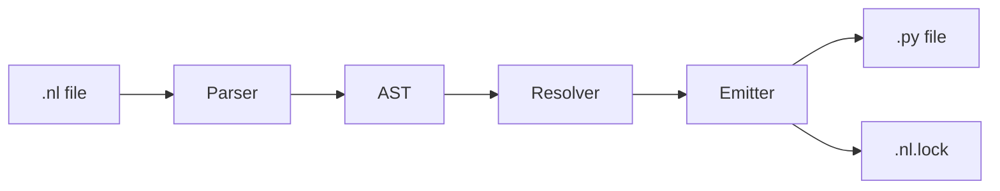

# Architecture

This document describes the internal architecture of the NLS compiler.

## Pipeline Overview



The compiler follows a classic pipeline architecture:

1. **Parser** — Converts `.nl` text to AST
2. **Resolver** — Validates dependencies and ordering
3. **Emitter** — Generates Python code
4. **Lockfile** — Records hashes for reproducibility

---

## Module Breakdown

### Core Modules

| Module                 | Purpose                      | Lines |
| ---------------------- | ---------------------------- | ----- |
| `parser.py`            | Regex-based parser           | ~500  |
| `parser_treesitter.py` | Tree-sitter parser           | ~600  |
| `resolver.py`          | Dependency resolution        | ~100  |
| `emitter.py`           | Python code generation       | ~400  |
| `lockfile.py`          | Hash computation and storage | ~200  |
| `schema.py`            | AST data structures          | ~300  |

### CLI Modules

| Module       | Purpose                             |
| ------------ | ----------------------------------- |
| `cli.py`     | Command-line interface              |
| `graph.py`   | Visualization (Mermaid, DOT, ASCII) |
| `diff.py`    | Change detection                    |
| `watch.py`   | File watcher                        |
| `atomize.py` | Python → NL extraction              |

---

## Parser Backends

### Regex Parser (Default)

The regex parser uses pattern matching to tokenize and parse `.nl` files.

```python
# Pattern examples from parser.py
ANLU_START = r"^\[([a-z][a-z0-9.-]*)\]\s*$"
DIRECTIVE = r"^@(module|version|target|imports)"
SECTION = r"^(PURPOSE|INPUTS|GUARDS|LOGIC|RETURNS|DEPENDS|EDGE CASES):"
```

**Pros:**

- Zero dependencies
- Fast for simple files
- Easy to understand

**Cons:**

- Limited error recovery
- Complex patterns for edge cases

### Tree-sitter Parser

The tree-sitter parser uses a formal grammar for parsing.

```bash
# Install tree-sitter support
pip install nlsc[treesitter]

# Use tree-sitter parser
nlsc --parser treesitter compile src/auth.nl
```

**Pros:**

- Better error recovery
- Incremental parsing
- Foundation for LSP/IDE support

**Cons:**

- Requires native dependency
- Slightly more complex setup

---

## AST Schema

The AST is defined in `schema.py`:

```python
@dataclass
class NLFile:
    module: ModuleDirective
    version: str | None
    target: str
    imports: list[str]
    anlus: list[ANLU]
    types: list[TypeDef]
    tests: list[TestSpec]
    literals: list[LiteralBlock]

@dataclass
class ANLU:
    identifier: str
    purpose: str
    inputs: list[InputDef]
    guards: list[Guard]
    logic: list[LogicStep]
    returns: str
    depends: list[str]
    edge_cases: list[EdgeCase]
```

---

## Resolution

The resolver validates:

1. **Dependency existence** — All `DEPENDS` references exist
2. **Cycle detection** — No circular dependencies
3. **Ordering** — Topological sort for code generation

```python
result = resolve_dependencies(nl_file)
if not result.success:
    for error in result.errors:
        print(f"{error.anlu_id}: {error.message}")
```

---

## Code Emission

The emitter transforms AST to Python:

### ANLU → Function

```nl
[add]
PURPOSE: Add two numbers
INPUTS:
  - a: number
  - b: number
RETURNS: a + b
```

Becomes:

```python
def add(a: float, b: float) -> float:
    """Add two numbers."""
    return a + b
```

### @type → Dataclass

```nl
@type Point {
  x: number
  y: number
}
```

Becomes:

```python
@dataclass
class Point:
    """Point type."""
    x: float
    y: float
```

### GUARDS → Validation

```nl
GUARDS:
  - divisor must not be zero -> ValueError("Cannot divide by zero")
```

Becomes:

```python
if divisor == 0:
    raise ValueError("Cannot divide by zero")
```

---

## Lockfile

Lockfiles ensure reproducible builds:

```yaml
# example.nl.lock
version: "1.0"
source_hash: "a1b2c3..."
target_hash: "d4e5f6..."
anlus:
  add:
    hash: "abc123..."
    inputs: ["a: number", "b: number"]
    returns: "a + b"
  multiply:
    hash: "def456..."
    inputs: ["a: number", "b: number"]
    returns: "a × b"
llm_backend: "mock"
compiled_at: "2024-01-15T10:30:00Z"
```

The lockfile enables:

- **Change detection** (`nlsc diff`)
- **Reproducible builds**
- **Audit trails**

---

## Extension Points

### Adding a New Target

1. Create `emitter_<target>.py`
2. Implement `emit_<target>(nl_file: NLFile) -> str`
3. Register in `cli.py` compile command

### Adding a New Parser Feature

1. Update grammar in `tree-sitter-nl/grammar.js`
2. Regenerate with `npx tree-sitter generate`
3. Update `parser_treesitter.py` to handle new nodes
4. Update `parser.py` with matching regex patterns

### Adding a New CLI Command

1. Create `cmd_<name>` function in `cli.py`
2. Add subparser in `main()`
3. Add case in command dispatch

---

## Testing

```bash
# Run all tests
pytest tests/ -v

# Run specific test module
pytest tests/test_emitter.py -v

# Run tree-sitter grammar tests
cd tree-sitter-nl && npx tree-sitter test
```

Test coverage includes:

- **12** regex parser tests
- **25** tree-sitter grammar tests
- **9** parser parity tests
- **15+** emitter tests
- Dataflow, guards, types, roundtrip tests

**Total: 160 tests passing**
