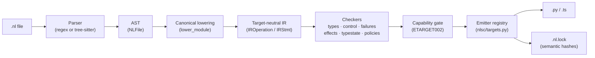

# Architecture

This document describes the internal architecture of the NLS compiler.

## Pipeline Overview


```mermaid
flowchart LR
    A[".nl file"] --> B["Parser<br/>(regex or tree-sitter)"]
    B --> C["AST<br/>(NLFile)"]
    C --> D["Canonical lowering<br/>(lower_module)"]
    D --> E["Target-neutral IR<br/>(IROperation / IRStmt)"]
    E --> F["Checkers<br/>types · control · failures<br/>effects · typestate · policies"]
    F --> G["Capability gate<br/>(ETARGET002)"]
    G --> H["Emitter registry<br/>(nlsc/targets.py)"]
    H --> I[".py / .ts"]
    H --> J[".nl.lock<br/>(semantic hashes)"]
```

The compiler has one shared frontend and one checked core:

1. **Parser** — regex and tree-sitter both produce the same `NLFile`; the
   regex parser is canonical for constructs the grammar does not cover
   (`@test`, `@literal`, `@use`, `@states`, `EFFECTS:`, `RETRY:`/`TIMEOUT:`,
   arrow steps), selected by `_should_use_regex_canonical_parse`.
2. **Lowering** — `lower_module` turns the AST into the target-neutral IR
   (both backends share it). Unsupported executable content becomes an
   explicit foreign node with a diagnostic, never a silent drop.
3. **Checkers** — typecheck (symbol table, `ESEM001`–`ESEM013`),
   controlflow (totality, immutability), failures (`#198`), effects
   (`#197`), typestate (`#200`), and retry/timeout policies (`#201`).
   Fatal diagnostics block every command before a backend runs.
4. **Capability gate** — the resolved IR is validated against the target's
   declared capabilities; a feature the target cannot emit fails with
   `ETARGET002` instead of producing an incomplete artifact.
5. **Emission** — the target registry (`nlsc/targets.py`) resolves the
   emitter; checked ANLU bodies render from IR statement nodes. Registry
   plugins can add targets through the `nlsc.targets` entry-point group.
6. **Lockfile** — records the semantic hash of each ANLU's canonical IR
   (scheme `sem3`), the target artifact hash, and the emitter semantics
   marker; `--frozen-lockfile` and `nlsc ci` re-derive and compare them.

---

## Module Breakdown

### Core Modules

| Module | Purpose |
| ------ | ------- |
| `parser.py` | Regex parser (canonical for directives, tests, policies) |
| `parser_treesitter.py` | Tree-sitter frontend with the regex fallback contract |
| `lowering.py` | AST → target-neutral IR; foreign-node diagnostics |
| `ir.py` | IR schema, canonical text/JSON rendering, invariants |
| `schema.py` | AST data structures |
| `typecheck.py` | Symbol table and semantic checks (`ESEM`) |
| `controlflow.py` | Branch totality, binding immutability, definite assignment |
| `failures.py` | Conservative failure sets (`#198`) |
| `effects.py` | Resource-identity effect sets and `EFFECTS:` bounds (`#197`) |
| `typestate.py` | Resource state protocols (`#200`) |
| `retry_policy.py` | Retry/timeout policy shape checks (`#201`) |
| `capabilities.py` | Capability matrix and gap diagnostics |
| `targets.py` | Target emitter registry and plugin entry points |
| `emitter.py` / `emitter_typescript.py` | Python and TypeScript backends |
| `lockfile.py` | Semantic hashes, target locks, rebuild |
| `pkg.py` | Package manifest, dependency resolution, package lock (`#146`) |
| `pipeline.py` | Shared parse/lower/gate boundary used by every command |
| `diagnostics.py` / `error_catalog.py` | Diagnostic constructors and the code catalog |
| `graph.py`, `diff.py`, `watch.py`, `atomize.py`, `lint.py`, `formatting.py`, `provenance.py`, `sandbox.py` | Tooling around the core pipeline |

### CLI Modules

| Module | Purpose |
| ------ | ------- |
| `cli.py` | All commands (`compile`, `run`, `ir`, `ci`, `lint`, `fmt`, `verify`, `test`, `graph`, `diff`, `watch`, `install`, `lock:check`, `lock:update`, `provenance`, `assoc`, `lsp`, `atomize`, `explain`, `init`) |
| `lsp/` | Language server (hover, completion, diagnostics, formatting) |

---

## Parser Backends

### Regex Parser (Canonical AST)

The regex parser uses pattern matching to tokenize and parse `.nl` files.

```python
# Pattern examples from parser.py
ANLU_START = r"^\[([a-z][a-z0-9.-]*)\]\s*$"
DIRECTIVE = r"^@(module|version|target|imports)"
SECTION = r"^(PURPOSE|INPUTS|GUARDS|LOGIC|RETURNS|DEPENDS|EDGE CASES):"
```

**Pros:**

- Zero dependencies
- Fast for simple files
- Easy to understand
- Canonical semantic contract for AST output

**Cons:**

- Limited error recovery
- Complex patterns for edge cases

### Tree-sitter Parser

The tree-sitter parser uses a formal grammar for parsing.

```bash
# Install tree-sitter support
pip install nlsc[treesitter]

# Use tree-sitter parser
nlsc --parser treesitter compile src/auth.nl
```

**Pros:**

- Better error recovery
- Incremental parsing
- Foundation for LSP/IDE support

**Cons:**

- Requires native dependency
- Slightly more complex setup

### Canonical Parser Contract

`nlsc/parser.py` is the canonical parser path for semantic AST output.

- `parse_nl_file()` defines the canonical AST shape and behavior.
- `parse_nl_file_treesitter()` may use tree-sitter for supported structural parsing, but it must return regex-equivalent AST output for every supported construct.
- When tree-sitter coverage is incomplete or semantics would diverge (for example `@test`, `@property`, `@invariant`, `@literal`, `@main`, or LOGIC output bindings), the implementation falls back to the regex parser to preserve parity.
- `nlsc/pipeline.py` auto mode follows the same rule: tree-sitter is optional acceleration, while regex semantics remain authoritative.

---

## AST Schema

The AST is defined in `schema.py`:

```python
@dataclass
class NLFile:
    module: ModuleDirective
    version: str | None
    target: str
    imports: list[str]
    anlus: list[ANLU]
    types: list[TypeDef]
    tests: list[TestSpec]
    literals: list[LiteralBlock]

@dataclass
class ANLU:
    identifier: str
    purpose: str
    inputs: list[InputDef]
    guards: list[Guard]
    logic: list[LogicStep]
    returns: str
    depends: list[str]
    edge_cases: list[EdgeCase]
```

---

## Resolution

The resolver validates:

1. **Dependency existence** — All `DEPENDS` references exist
2. **Cycle detection** — No circular dependencies
3. **Ordering** — Topological sort for code generation

```python
result = resolve_dependencies(nl_file)
if not result.success:
    for error in result.errors:
        print(f"{error.anlu_id}: {error.message}")
```

---

## Code Emission

The emitter transforms AST to Python:

### ANLU → Function

```nl
[add]
PURPOSE: Add two numbers
INPUTS:
  - a: number
  - b: number
RETURNS: a + b
```

Becomes:

```python
def add(a: float, b: float) -> float:
    """Add two numbers."""
    return a + b
```

### @type → Dataclass

```nl
@type Point {
  x: number
  y: number
}
```

Becomes:

```python
@dataclass
class Point:
    """Point type."""
    x: float
    y: float
```

### GUARDS → Validation

```nl
GUARDS:
  - divisor must not be zero -> ValueError("Cannot divide by zero")
```

Becomes:

```python
if divisor == 0:
    raise ValueError("Cannot divide by zero")
```

---

## Lockfile

Lockfiles ensure reproducible builds:

```yaml
# example.nl.lock
version: "1.0"
source_hash: "a1b2c3..."
target_hash: "d4e5f6..."
anlus:
  add:
    hash: "abc123..."
    inputs: ["a: number", "b: number"]
    returns: "a + b"
  multiply:
    hash: "def456..."
    inputs: ["a: number", "b: number"]
    returns: "a × b"
llm_backend: "mock"
compiled_at: "2024-01-15T10:30:00Z"
```

The lockfile enables:

- **Change detection** (`nlsc diff`)
- **Reproducible builds**
- **Audit trails**

### Semantic hashes (Issue #193)

Each ANLU's `source_hash` is the SHA-256 of its **canonical executable
semantics** — the target-neutral IR rendering (#194) covering ordered LOGIC
control, guards with error payloads, input constraints, edge cases, the
result contract, literal implementations, and the contract signatures of
declared dependencies. Narrative text (PURPOSE, free notes) and source line
numbers are excluded, so rewording documentation or moving code within a
file never invalidates a lock; changing a guard message, a constraint, a
logic expression, or a dependency's signature always does.

**Migration:** lock entries written before the `sem2` scheme (partial
identifier/purpose/returns hashes) never compare equal to new hashes, and
`sem3` adds read/write effect resource identities (#197) to the canonical
form. On first `nlsc compile` or `nlsc lock:update` after upgrading, every
legacy entry is conservatively reported as changed and regenerated — stale
cached bodies are never reused.

### Emitter semantics markers (Issue #202)

Each locked target also records a `semantics_version` marker (for example
`py-3`, `ts-2`) naming the backend semantics revision that produced the
artifact. The marker is part of the lock's identity: `nlsc compile
--frozen-lockfile` and `nlsc ci --compile` refuse a lockfile whose marker
differs from the current emitter with `ELOCK004`, even when the source and
the regenerated output hash still agree. Bump the marker in
`nlsc/capabilities.py` whenever an emitter changes the code it produces for
unchanged input. Lockfiles written before markers existed have no marker
and stay compatible.

---

## Extension Points

### Adding a New Target

1. Create `emitter_<target>.py`
2. Implement `emit_<target>(nl_file: NLFile) -> str`
3. Register a `TargetEmitter` in `nlsc/targets.py` (`register_target`) —
   capabilities, fatal classification, semantics marker, suffixes, and an
   optional output validator. Third-party packages can instead publish an
   `nlsc.targets` entry point; the CLI, capability matrix, and lockfile
   identity pick it up without core edits (#147).

### Adding a New Parser Feature

1. Update grammar in `tree-sitter-nl/grammar.js`
2. Regenerate with `npx tree-sitter generate`
3. Update `parser_treesitter.py` to handle new nodes
4. Update `parser.py` with matching regex patterns
5. Add or extend parity coverage in `tests/test_parser_parity.py` so the canonical AST remains identical across parser paths

### Adding a New CLI Command

1. Create `cmd_<name>` function in `cli.py`
2. Add subparser in `main()`
3. Add case in command dispatch

---

## Testing

```bash
# Run all tests
pytest tests/ -v

# Run specific test module
pytest tests/test_emitter.py -v

# Run tree-sitter grammar tests
cd tree-sitter-nl && npx tree-sitter test
```

Test coverage includes:

- **12** regex parser tests
- **25** tree-sitter grammar tests
- **9** parser parity tests
- **15+** emitter tests
- Dataflow, guards, types, roundtrip tests

**Total: 160 tests passing**
